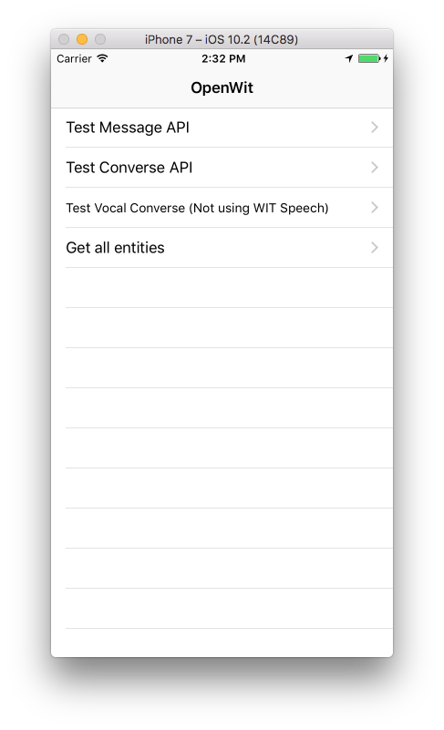
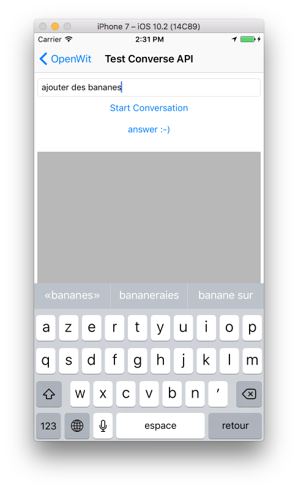
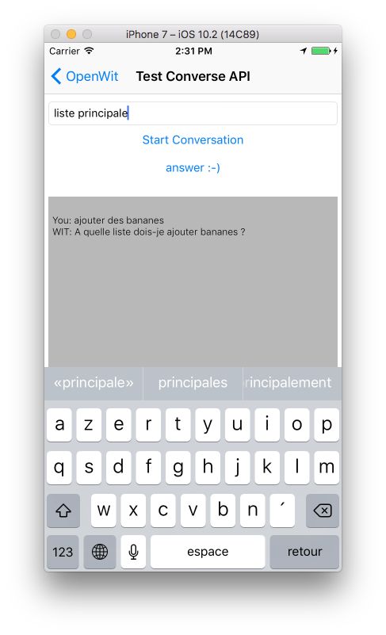
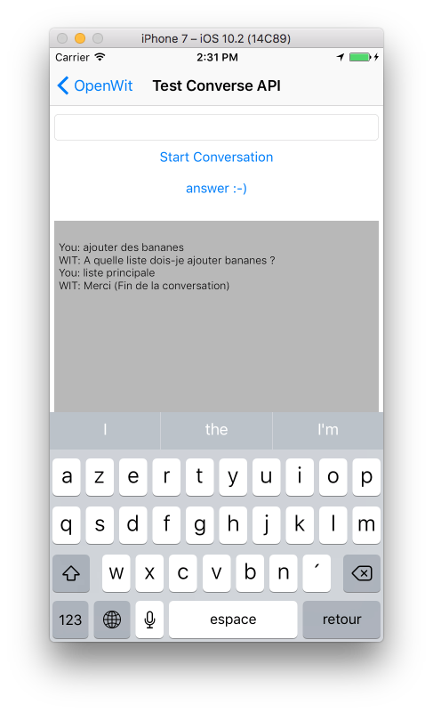
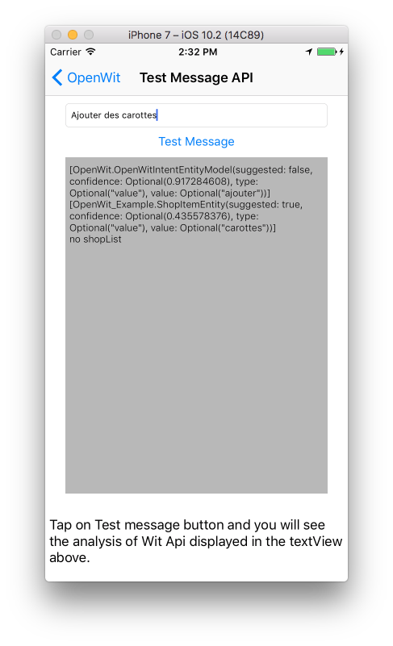
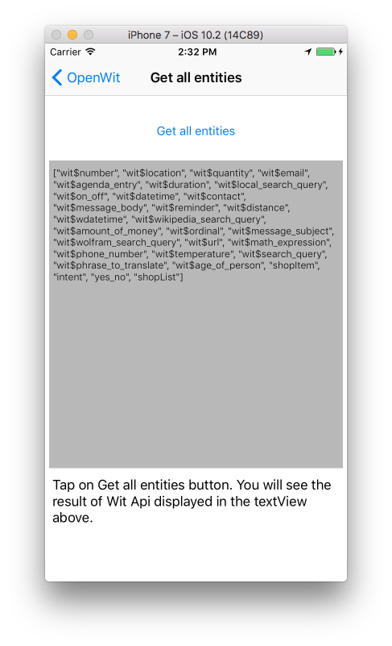
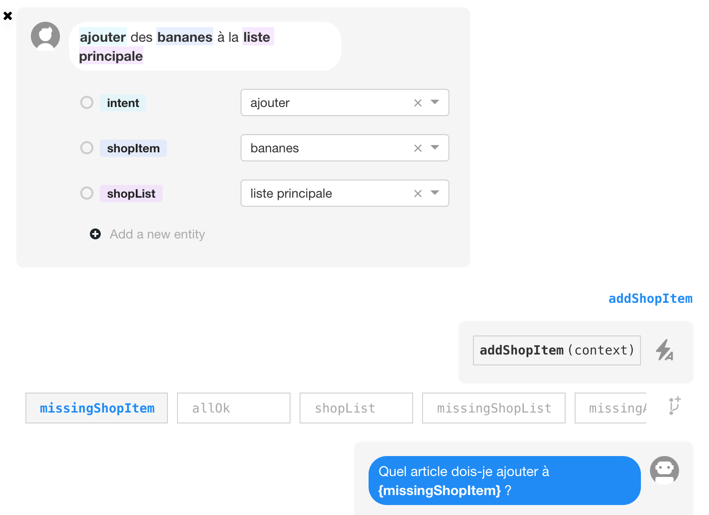

# OpenWit

[](http://cocoapods.org/pods/OpenWit)
[](http://cocoapods.org/pods/OpenWit)
[](http://cocoapods.org/pods/OpenWit)

This Pod is an intent to get a swift framework for Wit.ai© HTTP API.


You can find more information about Wit© on: https://wit.ai and https://wit.ai/docs/http/20160526
Wit© is an amazing NLP api where you can define stories (at the time of this writing they are in beta). Wit© does speech recognition, converse, message analyse, can learn to understand what you want and many more things.


This library is a first version where you can analyse a message and converse (speech is actually not fully implemented but should be soon). It requires Moya and ObjectMapper.

You can find some informations about how the Wit application is structured in the WitData folder.



###### Converse with WIT API:
  

###### Message with WIT API:


###### Entities:


## Example

To run the example project, clone the repo, and run `pod install` from the Example directory first.

###### Configure your WIT App:



###### in XCode:

Setup OpenWit sharedInstance with your own access tokens (generally in AppDelegate)

```swift
func application(_ application: UIApplication, didFinishLaunchingWithOptions launchOptions: [UIApplicationLaunchOptionsKey: Any]?) -> Bool {
    // Override point for customization after application launch.

    OpenWit.sharedInstance.WITTokenAcces = "WIT Client Token"
    OpenWit.sharedInstance.WITServerTokenAcces = "WIT Server Token"
    return true
}
```

Create a model if needed (Custom entity in Wit)

```swift
/// a custom entity defined in Wit
struct ShopItemEntity: Mappable {
    static var entityId = "shopItem"

    var suggested: Bool = false
    var confidence: Float?
    var type: String?
    var value: String?

    public init?(map: Map) {}

    mutating public func mapping(map: Map) {
        confidence          <- map[OpenWitJsonKey.confidence.rawValue]
        type                <- map[OpenWitJsonKey.type.rawValue]
        value               <- map[OpenWitJsonKey.mainValue.rawValue]
        suggested           <- map[OpenWitJsonKey.suggested.rawValue]
    }
}
```
Launch a request using method in OpenWit

```swift
OpenWit
    .sharedInstance
    .message(message,
    messageId: nil,
    threadId: nil) {[unowned self] result in
        switch result {
            case .success(let message):
                /// Your logic should start here... :-)
                /// intents are generic entities so they are built in
                self.printResult(message.intents?.description ?? "no intent", clearResult: true)
                /// shopItems are custom entities
                self.printResult(message.shopItems?.description ?? "no shopItem")
            case .failure(let error):
                print(error)
        }
    }
```

## Requirements

## Installation

OpenWit is available through [CocoaPods](http://cocoapods.org). To install
it, simply add the following line to your Podfile:

```ruby
pod "OpenWit"
```

## Author

fauquette fred, fredfocmac@gmail.com

## License

OpenWit is available under the MIT license. See the LICENSE file for more info.
